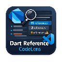

<div align="center">
  
  <h1>Dart Reference CodeLens</h1>
  <p>
    <b>Real-time reference counts for Dart & Flutter knowing exactly where your code is used.</b>
  </p>
  <br>
  
  <br>
  <br>
</div>

A Visual Studio Code extension that shows reference counts above classes, methods, constructors, and public variables in Dart files, powered by the Dart Analysis Server LSP.

## Features

- **Reference Counts**: Shows how many times each symbol is referenced across your codebase.
- **Zero Reference Warning**: Highlights symbols with 0 references with a ⚠️ icon to help you find unused code.
- **Click to Navigate**: Click on the reference count to see all references in a peek view.
- **Configurable**: Choose which symbols to show (classes, methods, properties, constructors, enums).
- **Smart Filtering**: Automatically excludes private members and generated files.

## Requirements

- VS Code 1.74.0 or higher
- [Dart Extension for VS Code](https://marketplace.visualstudio.com/items?itemName=Dart-Code.dart-code) installed and active.
- A Dart/Flutter project with the Dart Analysis Server running.

## Installation

### From Source

1.  **Clone the repository** (if you haven't already):
    ```bash
    git clone <repository-url>
    cd dart-reference-codelens
    ```

2.  **Install dependencies**:
    ```bash
    npm install
    ```

3.  **Compile the extension**:
    ```bash
    npm run compile
    ```

4.  **Package into VSIX**:
    You need `vsce` installed globally (`npm install -g @vscode/vsce`).
    ```bash
    vsce package
    ```
    This will generate a `.vsix` file (e.g., `dart-reference-codelens-1.0.0.vsix`).

5.  **Install in VS Code**:
    - Open VS Code.
    - Go to the **Extensions** view (`Ctrl+Shift+X` or `Cmd+Shift+X`).
    - Click the `...` (Views and More Actions) menu at the top right of the extension side bar.
    - Select **Install from VSIX...**.
    - Choose the generated `.vsix` file.

## Configuration

You can configure the extension in your `settings.json`:

| Setting | Default | Description |
|---------|---------|-------------|
| `dartReferenceCodeLens.enabled` | `true` | Enable/disable reference CodeLens |
| `dartReferenceCodeLens.showClasses` | `true` | Show reference counts for classes |
| `dartReferenceCodeLens.showMethods` | `true` | Show reference counts for methods/functions |
| `dartReferenceCodeLens.showProperties` | `true` | Show reference counts for public properties |
| `dartReferenceCodeLens.showConstructors` | `true` | Show reference counts for constructors |
| `dartReferenceCodeLens.showEnums` | `true` | Show reference counts for enums |
| `dartReferenceCodeLens.showVariables` | `true` | Show reference counts for top-level variables (e.g. Riverpod providers) |
| `dartReferenceCodeLens.highlightUnused` | `true` | Show warning icon for symbols with 0 references |
| `dartReferenceCodeLens.excludePatterns` | `["**/generated/**", "**/*.g.dart", "**/*.freezed.dart"]` | Files to exclude |
| `dartReferenceCodeLens.minReferencesToShow` | `0` | Minimum references to show CodeLens |
| `dartReferenceCodeLens.ignoredMethodNames` | `["build", "initState", "didChangeDependencies", ...]` | Flutter lifecycle methods to ignore |

### Example Configuration

```json
{
  "dartReferenceCodeLens.enabled": true,
  "dartReferenceCodeLens.showClasses": true,
  "dartReferenceCodeLens.showMethods": true,
  "dartReferenceCodeLens.highlightUnused": true,
  "dartReferenceCodeLens.excludePatterns": [
    "**/generated/**",
    "**/*.g.dart",
    "**/*.freezed.dart",
    "**/test/**"
  ],
  "dartReferenceCodeLens.ignoredMethodNames": [
    "build"
  ]
}
```

## How It Works

1.  When you open a Dart file, the extension requests document symbols from the Dart Analysis Server.
2.  For each public symbol, it queries the LSP for references.
3.  The reference count is displayed as a CodeLens above the symbol.
4.  Reference counts are lazy-loaded (calculated only when visible/expanded) to maintain performance.

## Troubleshooting

- **No CodeLens appearing?**
    - Ensure the Dart Analysis Server is finished analyzing.
    - Check if `dartReferenceCodeLens.enabled` is true.
    - Ensure your file is not in `excludePatterns`.
- **"0 references" not showing warning?**
    - Check if `dartReferenceCodeLens.highlightUnused` is true.
